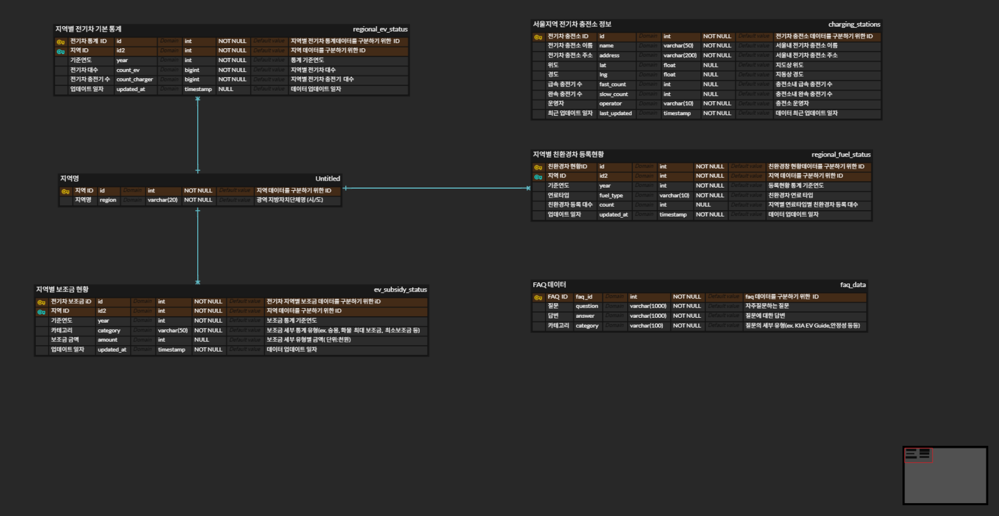
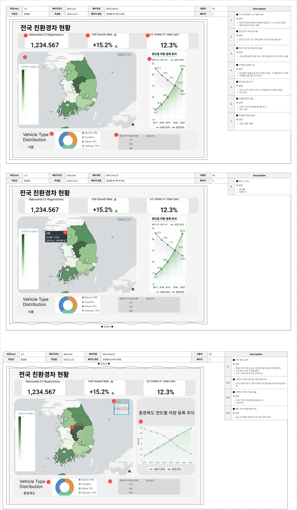
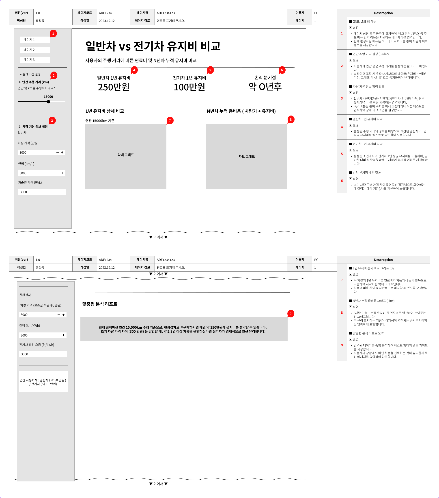
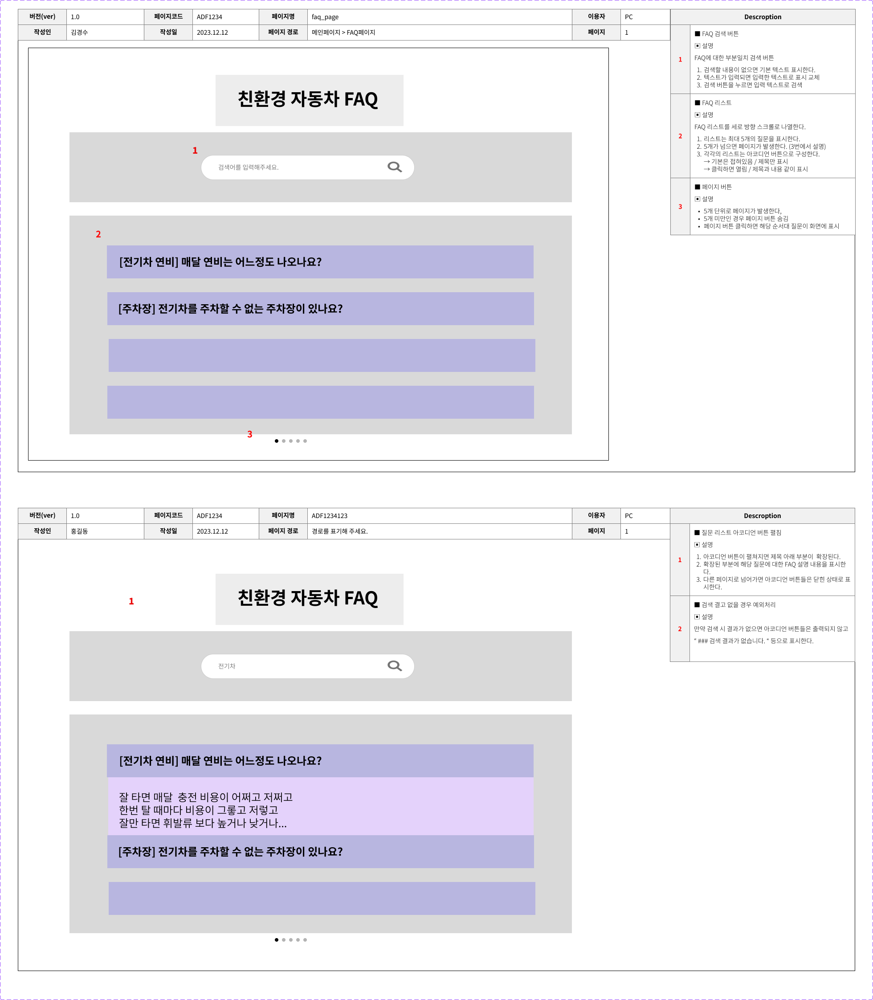
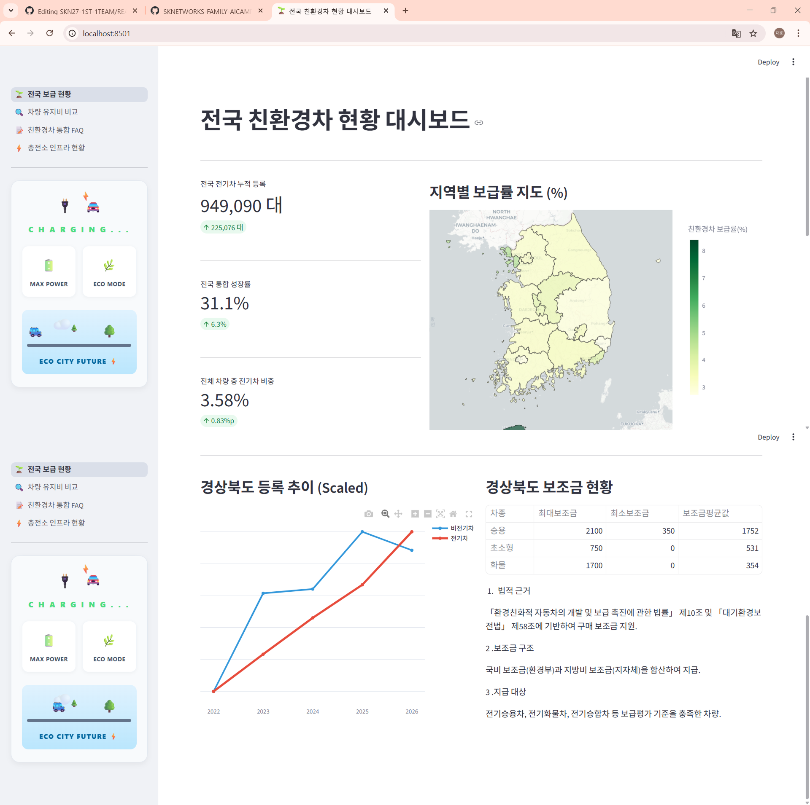
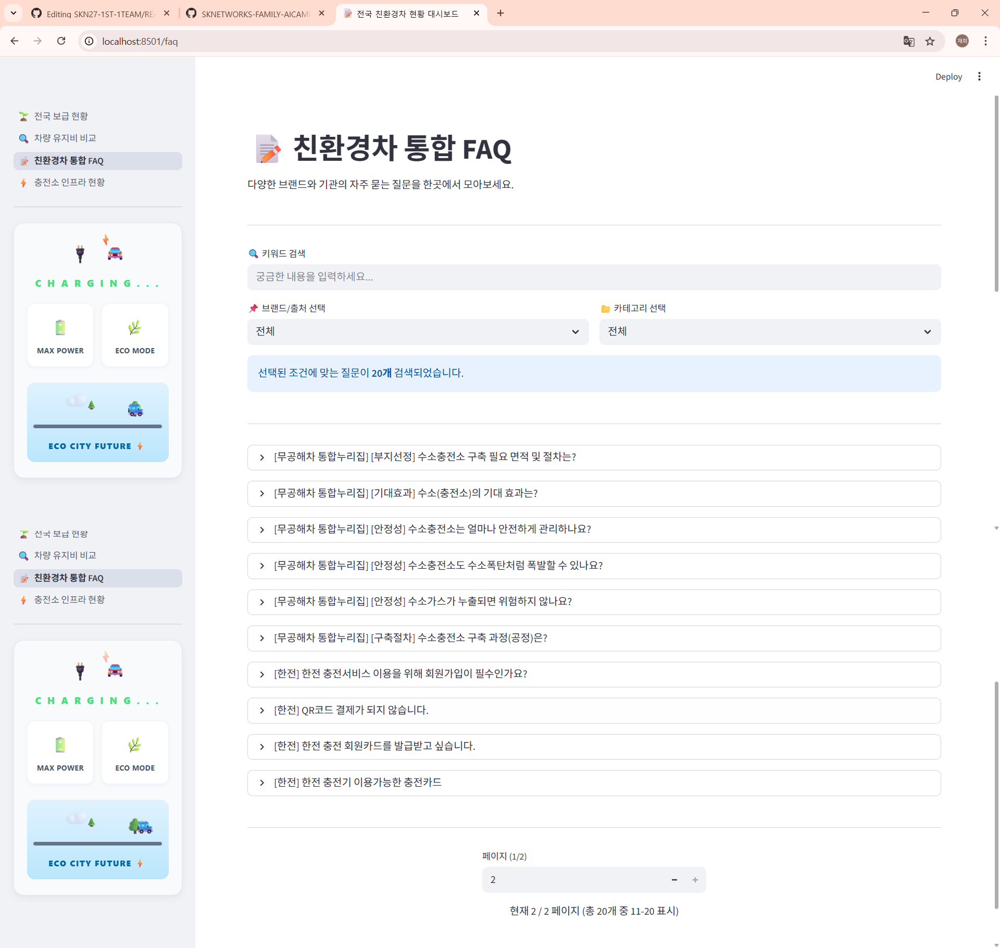
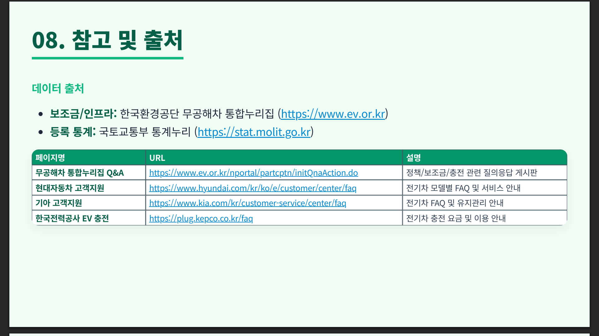

# 전국 친환경차 현황 대시보드 및 유지비 계산 시뮬레이터

# 1. 팀 소개
## 1-1. 팀원 소개
| 팀원1 | 팀원2 | 팀원3 | 팀원4 | 팀원5 | 팀원6 |
|---|---|---|---|---|---|
|  |  |  |  |  |  |
| [이재희](#) | [김민경](#) | [김경수](#) | [이재강](#) | [한재웅](#) | [신동혁](#) |

# 2. 프로젝트 개요
## 2-1. 프로젝트 명
**전국 친환경차 현황 대시보드 및 유지비 시뮬레이션 서비스**
## 2-2. 프로젝트 소개
본 프로젝트는 친환경차(전기차)에 대한 관심이 높아지는 흐름에 맞춰, 사용자들이 전국적인 보급 현황을 한눈에 파악하고 실제 구매 의사결정에 필요한 정보를 제공하는 것을 목표로 한다. 지역별 전기차 등록 대수, 보조금 현황, 충전 인프라 위치 정보를 시각화하며, 특히 내연기관차와의 유지비 비교를 통해 경제적 이점을 정량적으로 분석해 준다.
## 2-3. 프로젝트 배경
> 전 세계적으로 탄소 중립 정책이 강화되면서 전기차 시장이 급성장하고 있으나, 예비 구매자들은 여전히 충전 인프라 부족, 높은 실구매가, 유지비에 대한 막연한 불안감을 가지고 있다. 이러한 불안감을 해소하기 위해 공공 데이터를 활용한 정확한 정보 제공이 핵심적인 역할을 한다.

## 2-4. 프로젝트 목표
**① 데이터 기반 보급 현황 시각화:** 전국 17개 시도의 전기차 보급률 및 전년 대비 성장률을 인터랙티브 지도로 제공 <br>
**② 실질적 구매 정보 지원:** 지자체별 상이한 전기차 구매 보조금 정보를 체계적으로 정리하여 제공 <br>
**③ 경제적 이점 분석:** 사용자의 연간 주행 거리와 유가/전기료를 기반으로 한 총 소유 비용(TCO) 비교 시뮬레이터 개발 <br>
**④ 충전 인프라 접근성 향상:** 현재 거주지 주변의 충전소 위치 및 밀집도를 시각화하여 정보 접근성 강화 <br>

## 2-5. 기대 효과
- 전기차 도입을 고민하는 사용자에게 객관적인 경제성 지표 제공
- 지역별 보조금 및 인프라 현황 파악을 통한 구매 편의성 증대
- 데이터 시각화를 통한 친환경차 보급 트렌드에 대한 인사이트 도출

# 3. 기술 스택
| 분류 | 기술/도구 |
|---|---|
| 언어 |  |
| 라이브러리 |    |
| 데이터베이스 |  |
| 인프라 |  |

# 4. WBS (작업 분할 구조)
- [x] 데이터 수집: 환경부, 통계청 등 공공 데이터 포털 활용
- [x] 데이터베이스 설계: 지역별 등록 현황, 보조금, 충전소 정보 DB화
- [x] 대시보드 개발: Streamlit 기반 UI 구성 및 Plotly 시각화 적용
- [x] 시뮬레이터 개발: 차종별 연비/전비 기반 유지비 계산 로직 구현
- [x] 인프라 지도 구현: Folium/Plotly Mapbox 연동

# 5. 데이터 분석 및 전처리 (EDA)
## 5-1. 활용 데이터
- `regional_ev_status`: 전국 시도별 전기차 및 내연기관차 등록 현황
- `ev_subsidy_status`: 지자체별 차종별(승용/화물/초소형) 보조금 정보
- `charging_stations`: 전국 전기차 충전소 위치 및 운영 정보
- `faq_data`: 친환경차 관련 자주 묻는 질문 및 답변 데이터

## 5-2. 주요 전처리 내용
- 지역명 표준화 (예: 서울 -> 서울특별시)
- 데이터 타입 정제 (수치형 변환, 날짜 데이터 처리)
- 결측치 처리 및 지역별 통계 요약 피벗 테이블 생성

<br>

# 6. 요구사항 정의서 (Requirement Specification)
<br>
<br>
<div class="img-wrapper">
  
</div>
<br>

# 7. ERD (Entity Relationship Diagram)
<br>
<br>
<div class="img-wrapper">
  
</div>
<br>

# 8. 프로젝트 구조

```text
📦 SKN27-1ST-1TEAM
├── .gitignore
├── app.py
├── migrate_data.py
├── README.md
├── requirements.txt
├── components/
│   ├── sidebar_widget.py
│   └── __init__.py
├── csv/
│   ├── charging_stations.csv
│   ├── ev_subsidy_status.csv
│   ├── faq_data.csv
│   ├── regional_ev_status.csv
│   └── regional_fuel_status.csv
├── docker/
│   ├── docker-compose.yml
│   └── Dockerfile
├── md/
│   ├── DATA_MIGRATION_GUIDE.md
│   └── SETUP_GUIDE.md
├── pages/
│   ├── compare.py
│   ├── faq.py
│   └── infrastructure.py
├── scripts/
│   ├── crawl_faq.py
│   ├── geocode_stations.py
│   └── sync_infra.py
└── utils/
    └── db_manager.py
```
<br>


# 9. 화면 설계서 (Wireframe & UI Design)

<br>
<br>
<div class="img-wrapper">
  
</div>
<br>
<div class="img-wrapper">
  
</div>
<br>
<div class="img-wrapper">
  
</div>
<br>

# 10. 주요 구현 내용 (Technical Implementation)
<br>
<br>
<div class="img-wrapper">
  
</div>
<br>
<div class="img-wrapper">
  
</div>
<br>
<div class="img-wrapper">
  
</div>
<br>
<div class="img-wrapper">
  
</div>
<br>

# 11. 수행 결과 (Streamlit 대시보드)
## 주요 기능
✔️ **전국 보급 현황:** 지도 위 마우스 오버를 통해 지역별 전기차 비중 및 성장률 확인 <br>
✔️ **차량 유지비 비교:** 내연기관차 vs 전기차 10년 유지비 시뮬레이션 및 손익분기점 도출 <br>
✔️ **충전소 인프라:** 지역별 충전소 밀도를 히트맵으로 확인하고 상세 위치 검색 <br>
✔️ **통합 FAQ:** 검색창을 통한 신속한 정보 확인 <br>

# 12. 개발 중 주요 이슈 및 해결
### 12-1. Docker 환경 구축 및 연결 이슈
- **문제**: Docker 컨테이너 기반으로 MySQL을 구성하는 과정에서 컨테이너 간의 네트워크 연결 및 호스트와의 포트 포워딩 설정에 어려움 발생. 특히 설정을 바꿀 때마다 `docker-compose down`과 `up`을 반복하며 환경을 최적화하는 과정에서 많은 시간이 소요됨.
- **해결**: Docker Compose 설정을 단계적으로 수정하며 컨테이너 라이프사이클을 관리하는 법을 익혔고, 최종적으로 안정적인 DB 연결 환경을 구축함.

### 12-2. 협업 시 데이터 동기화 문제
- **문제**: 다른 팀원들이 배포된 저장소를 `clone`하여 작업할 때, DB 스키마는 생성되나 데이터 테이블이 비어 있어 앱이 정상 작동하지 않는 이슈 발생. 이를 파이썬 코드를 통한 자동 마이그레이션으로 해결하려 했으나 초기 설정의 복잡함으로 인해 구현에 난항을 겪음.
- **해결**: 데이터 무결성과 즉각적인 팀원 간 공유를 위해 모든 데이터를 CSV 파일로 관리하고, DB 초기화 시 CSV를 자동으로 로드하는 방식을 채택하여 해결함.
- **향후 계획**: 현재의 CSV 로드 방식을 넘어, 향후에는 완전히 코드 기반의 데이터 마이그레이션 및 자동 삽입 로직을 고도화할 예정임.

# 13. 한계점 및 향후 과제
- 실시간 데이터 연동: 현재는 CSV/DB 기반 정적 데이터로, 향후 API 실시간 연동 필요
- 차량 모델 다양화: 시뮬레이터에 등록된 기본 차량 외 최신 출시 모델 지속 업데이트 필요
- 사용자 맞춤형 추천: 주행 패턴 분석을 통한 최적 차종 추천 알고리즘 고도화

# 14. 데이터 수집 자료

<br>
<div class="img-wrapper">
  
</div>
<br>

# 15. 한 줄 회고
- **27기_김경수**: 개발 과정 중 필요한 작업들을 알 수 있어서 좋았습니다. 다만, 첫 프로젝트라 작업에 필요한 이슈, 기획서 들이 없어서 겪는 문제들이 아프게 다가왔고 다음 프로젝트에는 화면설계, 요구사항 정의서, ERD 설계 등을 충실하게 진행해서 진행 과정 중 발생하는 문제들을 줄일 수 있으면 좋을 것 같습니다.
- **27기_이재강**: DB 전처리와 연동을 통해 데이터 활용 계획과 요구사항 정의가 시스템의 핵심임을 체감하였습니다. 개인적으로 차기 프로젝트에서는 정교한 데이터베이스 설계를 바탕으로 데이터의 선택 이유와 목적을 명확히 정의하고, 도출된 인사이트가 실질적으로 연결될 수 있도록 구현 역량을 높이도록 하겠습니다.
- **27기_한재웅**: 이번 첫 프로젝트를 통해서 단순한 통계 데이터를 이용하여 유의미한 분석 결과를 도출하는데 대한 직접적인 협업 경험을 할 수 있어 좋았습니다. 다만 아직 첫 프로젝트이기에 자료 조사 및 ERD작성 등 서포트 역할만을 맡았다는 한계도 있었습니다. 따라서 앞으로는 이번 프로젝트 경험을 바탕으로 다양한 데이터를 수집하고 분석하는데 개인적으로 더 많은 역할을 할 수 있다면 좋을 것 같습니다.
- **27기_신동혁**: 첫 프로젝트인 만큼 긴장감도 있었고, 제가 잘 할 수 있을지에 대해서 의문점을 가지고 있었습니다. 하지만 팀장님의 리더쉽과 역할배분이 완벽하여 저도 1인분을 할 수 있었던 것 같습니다. 이번엔 팀장님을 잘 만나 프로젝트를 성공적으로 끝냈지만 다음엔 저도 팀장님을 본 받아 팀장님같은 개발자로 성장하고 싶습니다.
- **27기_김민경**: 이번 프로젝트를 진행하며 streamlit에 적응하기까지 고충을 겪었지만 팀원들의 요구사항을 실시간으로 반영하며 성취감을 얻을 수 있었습니다. streamlit의 특성을 파악하고 최선의 결과물을 도출해 낸 의미있는 시간이었습니다
- **27기_이재희**: 초기에는 DB 연결 라우팅과 Docker 아키텍처에 대한 이해가 부족하여 환경 구축에 어려움을 겪었지만, 문제를 해결해 나가면서 컨테이너 기반 배포의 흐름을 깨닫는 경험이었습니다.
